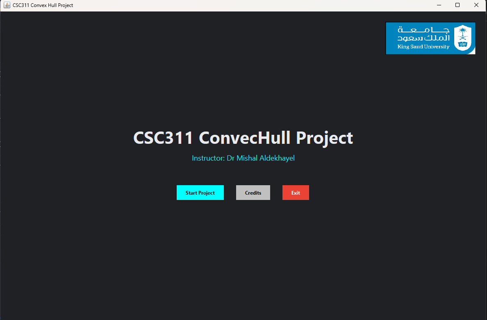
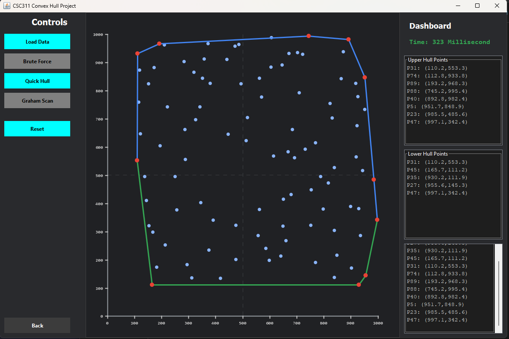

# CSC 311 - Convex Hull Visualizer



A Java Swing application designed to compute and visualize the convex hull of a set of points in the Euclidean plane. This project was developed as "Project I - Convex Hull" for the **CSC 311: Design and Analysis of Algorithms** course at King Saud University (CCIS, Fall 2025).

The application reads input points, computes the hull using various algorithms, and plots the results on an interactive GUI, providing a visual way to understand algorithm behavior.

## 🚀 Features

* **Interactive Visualizer:** An intuitive dashboard with a dark theme, grid, and scaled coordinate axes.

* **Multiple Algorithms:** Compare the execution of Brute Force, QuickHull, and Graham Scan on the same dataset.

* **Color-Coded Output:** Distinctively visualizes the Upper Hull in blue, the Lower Hull in green, and Extreme Points in red.

* **Performance Tracking:** Captures and displays execution time (in milliseconds) for direct algorithm comparison.

* **Detailed Analytics:** Outputs the exact coordinates of the upper hull, lower hull, and extreme points directly in the GUI dashboard.


## 🧠 Implemented Algorithms


This project implements three distinct algorithms to compute the convex hull, allowing for a comprehensive comparison of their time complexities:



1. **Brute Force (Gift Wrapping version)**
* **Description:** Starts at the lowest point and repeatedly selects the next point with the maximum angle. It is the simplest approach but the slowest.

* **Complexity:** $O(nh)$ with a worst-case time complexity of $O(n^2)$.
________________________________________________________________________________________________________________________________________________________________________________________________
2. **QuickHull (Divide & Conquer)**
* **Description:** Splits points by the leftmost and rightmost extremes, then recursively finds the farthest points to form the hull. It performs well on average.

* **Complexity:** Average time complexity of $O(n \log n)$ and a worst-case of $O(n^2)$.
________________________________________________________________________________________________________________________________________________________________________________________________
3. **Graham Scan**
* **Description:** Sorts points by polar angle and uses a stack to maintain left turns. It was found to be the fastest and most stable algorithm in this project.


* **Complexity:** Consistent time complexity of $O(n \log n)$.
_________________________________________________________________________________________________________________________________________________________________________________________________


## 📂 Project Structure

* `ConvexHullApp.java`: The main application controller handling the CardLayout, welcome screen, and main dashboard UI.
* `DrawerPanel.java`: The core visualization engine. Handles scaling, drawing points, sorting indices, and houses the logic for the three convex hull algorithms.
* `Reader.java`: A utility class responsible for parsing the input data points from a text file and loading UI assets (like the university logo).

## 🛠️ How to Run

1. **Clone the repository:**
```bash
git clone https://github.com/Pb22j/ConvexHull.git
cd ConvexHull

```

2. **Copy all files into any java Project files:**
Creat a new java project and copy all the src files into that java project you just create

2. **Compile the Java files:**
```bash
javac *.java

```


3. **Run the application:**
```bash
java ConvexHullApp

```


4. **Usage:** Click "Start Project", use the "Load Data" button to import a `.txt` file containing your data points, and select an algorithm from the left control panel to see the visualization. \
  -There is the file "data12.txt" you can use it as test-
## 📝 Input Data Format

The application expects input data as a single line of comma-separated coordinates enclosed in parentheses, like so:

```text
(110.2,583.3),(165.7,111.2),(930.2,111.9),(955.6,145.3)

```

(Note: A sample file `datapoints1.txt` can be used to test the simple run.)

## 🎓 Credits

This project was developed under the instruction of Dr. Mishal Aldekhayel.

**Group Members:**

* Mohammed Alwanis  
* Waleed Alnajashi  
* Fahad Alsuhaibani  
* Abdulrahamn Almzeal
